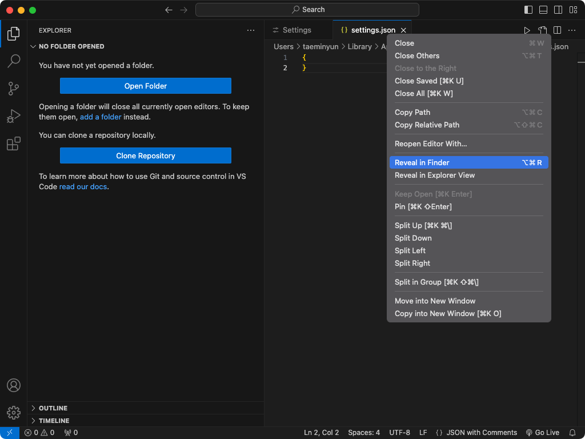

# Visual Studio Code Config
Visual Studio Code의 설정을 저장합니다.

## 목차
- [소개](#introduction)
- [settings](#settings)
- [snippets](#snippets)

## 소개
### 저장소의 파일 구조
해당 저장소의 파일 구조는 macOS의 아래를 경로를 기준으로 작성되었습니다.
> /Users/{user_name}}/Library/Application\ Support/Code/User

파일 구조는 다음과 같습니다.
```
Code/
└── User/                 // 해당 폴더
    ├── settings.json
    └── snippets/
        └── ...
```

VSCode의 설정을 위해 해당 파일 구조의 적절한 파일들을 확인해 추가합니다.
### 현재 PC의 User 경로 찾기
1. Command Palette... or ⇧⌘P
2. Open User Settings (JSON)
3. Reveal in Finder를 통해 settings.json 찾기

4. settings.json을 기준으로 상위 첫 번째 폴더가 User

### 현재 VSCode의 Code 위치

## settings

## snippets
